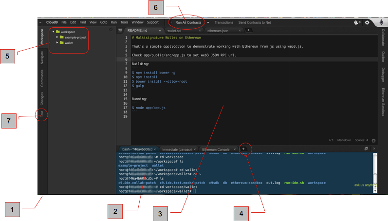

# Ethereum Studio IDE work flow

1.  Once logged into Ethereum Studio, the screen colors can be ajusted to suit your visual confort. This one is the midnight theme to reduce glare. Colors can be ajusted via the Clud9 menu -preferences-themes.
2.  Unix terminal Bourne Shell (BASH), with npm and basic Unix commands. The Studio IDE is running on a remote Ubuntu computer. It's your Linux computer accessible from any browser. You can issue [standard Unix commands](http://freeengineer.org/learnUNIXin10minutes.html), install npm node.js modules and [sync with github](https://docs.c9.io/docs/setting-up-github-workspace) repositories.
3.  Configurable tabbed editor screen compatible with standard code editors. Features full syntax highlighting (Solidity, javascript and all popular languages).
4.  Click to open a new terminal console.
5.  Your workspace directories. Here we see two separate projects. You can have multiple projects in your workspace. Just change directories (cd ~/[project directory name]
6.  Run all contracts/run active contracts buttons: use to run all your contracts in your curret directory. Or use 'run active contracts' to run only the opened contracts .sol code in the text editor [3.]
7.  Mocha testing button. (see testing section).

