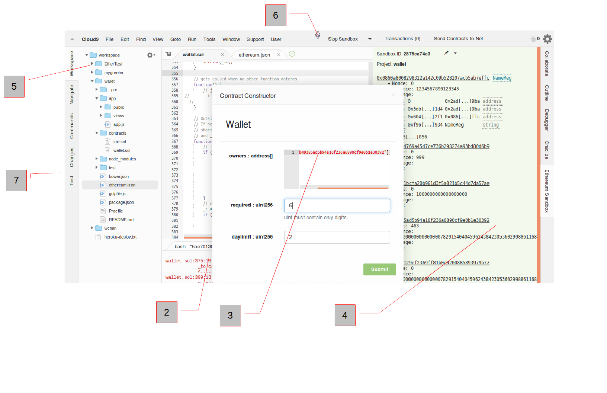

# Running a contract

Once you have a solidity contract code written and saved with .sol suffix, you can run the contract (deploy)it to the sandbox for testing. The wallet multisig example contract is shown here. Using the terminal, you can load the wallet app example into your workspace from github (see Example projects section). Make wallet folder your current directory. 

1. Shown here on the screen an example: the wallet.sol multi signature wallet solidity contract. 
2. Ethereum console shows the output log of transactions
3. The pop-up appears when we run the sandbox (see item #6). The pop-up is the contract constructor to set the parameters of the contract deployment on the blockchain (sandbox or the live ethereum blockchain). In this specific case, the wallet contract needs address(es) as a string array (eg. ["0xdedb49385ad5b94a16f236a6890cf9e0b1e30392"] of the wallet owner(s). The field below is amount of ether held (integer), and _daylimit (integer) spend limit.
4. The sandbox panel lists sandboxID, account addresses and deployed contracts on the sandbox simulated blockchain. See sandbox panel in next section.
5. The project directory structure. The wallet example project has a directory structure typical of node.js express devlopement. 
6. Run contract(s) / stop sandbox button.
7. Mocha testing button. (see testing section).

To view the app on your browser, select 'run' menu- run node.js

